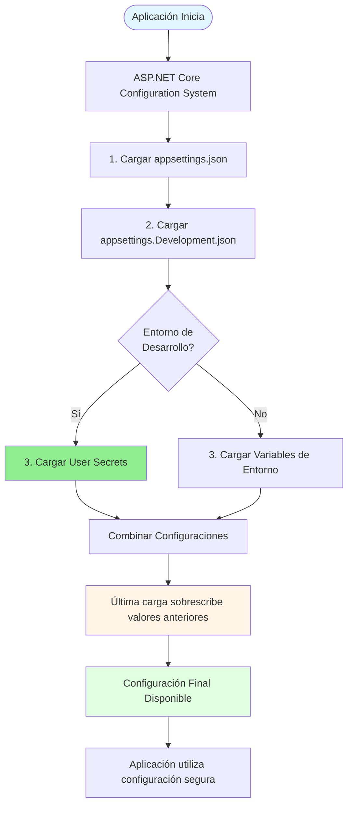
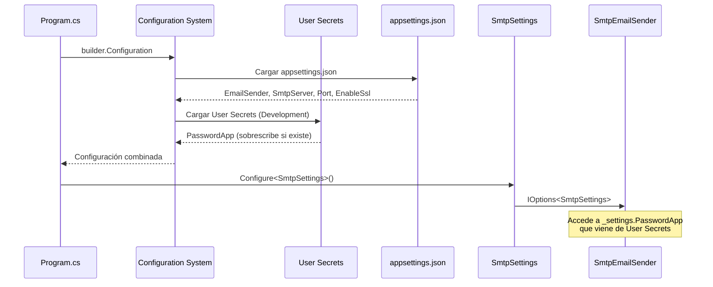
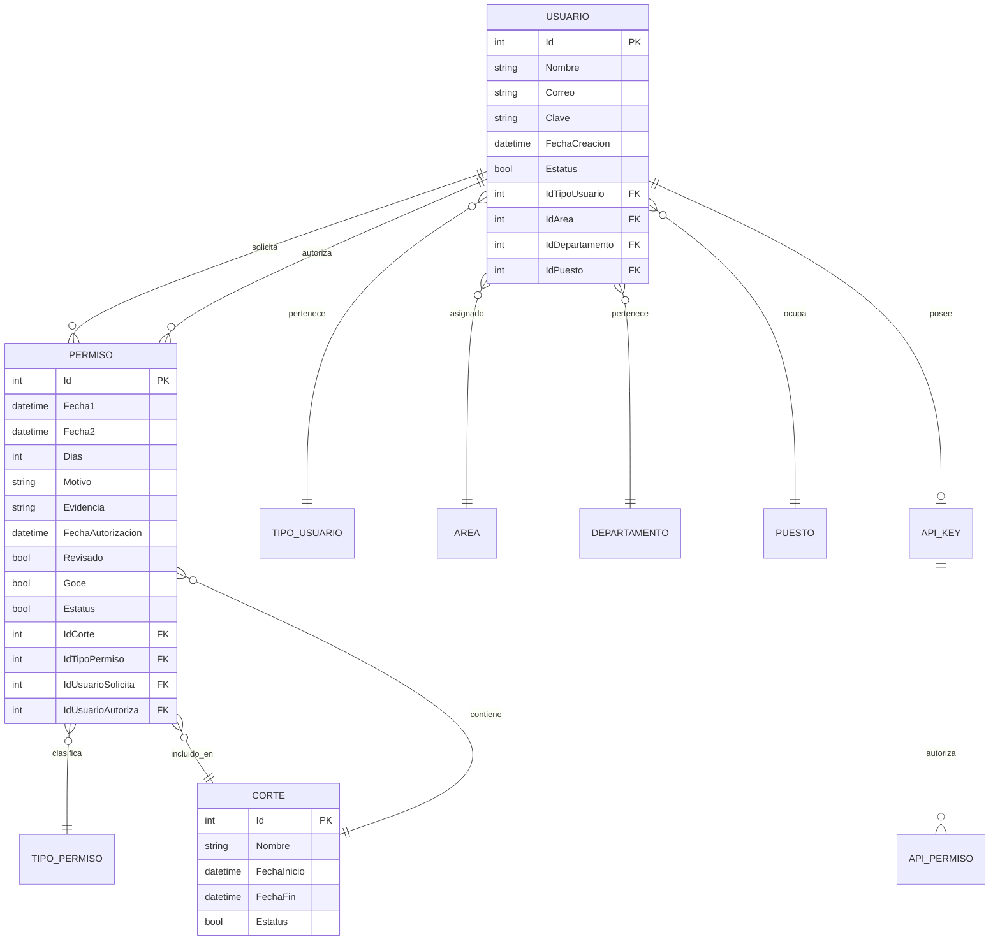
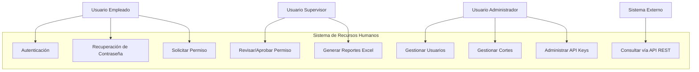
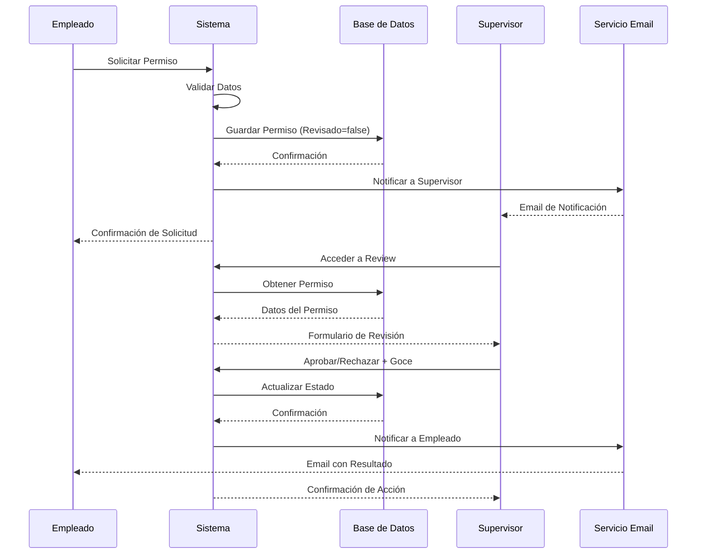
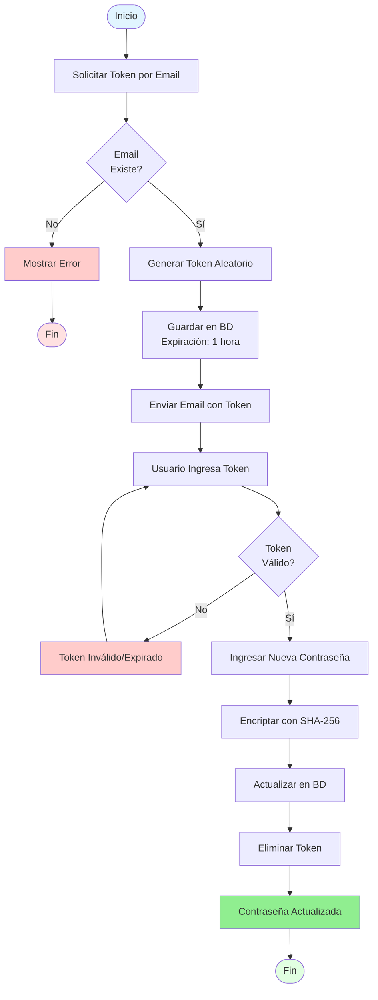

# Sistema de Gestión de Recursos Humanos

[](https://dotnet.microsoft.com/)
[](https://docs.microsoft.com/aspnet/core)
[](https://www.microsoft.com/sql-server)
[](https://docs.microsoft.com/ef/core)

## Descripción General

Sistema empresarial de gestión de recursos humanos desarrollado para optimizar la administración de permisos laborales, control de usuarios, gestión de cortes de nómina y control de acceso mediante API Keys. La aplicación está construida sobre .NET 8 utilizando el patrón arquitectónico MVC (Model-View-Controller) con Entity Framework Core como capa de acceso a datos.

## Características del Sistema

### Módulo de Autenticación
- Autenticación basada en cookies con protocolo seguro
- Sistema de recuperación de contraseñas mediante tokens temporales
- Gestión de sesiones con expiración configurable
- Control de acceso basado en roles y permisos

### Módulo de Permisos
- Solicitud y aprobación de permisos laborales
- Clasificación por tipo: Con goce de sueldo / Sin goce de sueldo
- Estados de seguimiento: Pendiente, Aprobado, Rechazado
- Adjunto de documentación de soporte en formato PDF
- Cálculo automático de días hábiles
- Generación de reportes en formato Excel

### Módulo de Usuarios
- Operaciones CRUD completas para gestión de usuarios
- Estructura organizacional por áreas, departamentos y puestos
- Sistema de tipos de usuario con permisos diferenciados
- Cifrado de contraseñas mediante algoritmo SHA-256
- Funcionalidades de búsqueda y filtrado avanzado
- Interfaz de visualización por tarjetas con paginación

### Módulo de Cortes de Nómina
- Definición de períodos de corte
- Vinculación de permisos a cortes específicos
- Visualización detallada de permisos por período
- Gestión de estados: Activo, Cerrado, En Proceso

### Módulo de API Keys
- Generación de claves de acceso únicas
- Vinculación de API Keys a usuarios específicos
- Control granular de permisos por API Key
- Gestión de recursos y funciones accesibles

### Sistema de Notificaciones
- Envío de tokens para recuperación de contraseñas
- Notificaciones de cambios de estado en permisos
- Configuración SMTP flexible

## Stack Tecnológico

### Backend
- **Runtime**: .NET 8.0
- **Framework Web**: ASP.NET Core MVC
- **ORM**: Entity Framework Core 9.0.7
- **Base de Datos**: Microsoft SQL Server
- **Object Mapping**: AutoMapper 12.0.1
- **Autenticación**: Cookie-based Authentication

### Frontend
- **View Engine**: Razor Pages
- **CSS Framework**: Bootstrap 5
- **JavaScript**: ES6+ Vanilla JavaScript
- **Iconografía**: Font Awesome
- **Alertas**: SweetAlert2
- **Paginación**: X.PagedList.Mvc.Core 10.5.9

### Utilidades
- **Generación de Excel**: ClosedXML 0.105.0
- **Email**: System.Net.Mail (SMTP)
- **Code Generation**: Microsoft.VisualStudio.Web.CodeGeneration.Design
- **Logging**: ASP.NET Core ILogger

## Arquitectura del Sistema

El sistema implementa una arquitectura en capas basada en el patrón MVC (Model-View-Controller):

### Capas de la Arquitectura

#### 1. Capa de Presentación (Presentation Layer)
- **Views**: Plantillas Razor para renderizado HTML
- **Assets**: Recursos estáticos (CSS, JavaScript, imágenes)
- **Client Validation**: Validación del lado del cliente

#### 2. Capa de Controladores (Controller Layer)
- **PermisosController**: Gestión de permisos laborales
- **UsuariosController**: Administración de usuarios
- **CortesController**: Manejo de cortes de nómina
- **ApiKeysController**: Gestión de claves API
- **AccountController**: Autenticación y autorización
- **ResetPasswordController**: Recuperación de contraseñas

#### 3. Capa de Lógica de Negocio (Business Logic Layer)
- **ViewModels**: Modelos para transferencia de datos a vistas
- **DTOs**: Objetos de transferencia de datos
- **AutoMapper**: Mapeo automático entre entidades
- **Services**: Servicios de negocio (Email, Autenticación)

#### 4. Capa de Acceso a Datos (Data Access Layer)
- **Entity Framework Core**: ORM para acceso a base de datos
- **DbContext**: Contexto de base de datos
- **Repositories**: Patrones de repositorio (integrados en EF Core)

#### 5. Capa de Datos (Database Layer)
- **SQL Server**: Sistema de gestión de base de datos relacional
- **Tablas**: Usuarios, Permisos, Cortes, ApiKeys, etc.

### Flujo de Datos

```
Usuario ? Controller ? ViewModel/DTO ? Service ? DbContext ? Database
                ?                                                ?
             View ? ViewModel ? Mapper ? Entity ? DbContext ? SQL
```

## Requisitos del Sistema

### Software Requerido
- .NET 8 SDK o superior
- SQL Server 2019 o superior (Express, Developer, Standard, o Enterprise)
- Visual Studio 2022 o Visual Studio Code
- Git (control de versiones)

### Configuración Requerida
- Servidor SMTP para envío de correos electrónicos (opcional)
- Certificado SSL para HTTPS en producción

### Verificación de Requisitos

```powershell
# Verificar versión de .NET
dotnet --version

# Verificar SQL Server
sqlcmd -S localhost -E -Q "SELECT @@VERSION"
```

## Instalación y Configuración

### 1. Clonar Repositorio

```bash
git clone https://github.com/rriojas/TecRHPermisos.git
cd TecRHPermisos
```

### 2. Restaurar Dependencias

```bash
dotnet restore
```

### 3. Configurar Cadena de Conexión

Crear o editar el archivo `appsettings.json` con la configuración de base de datos:

```json
{
  "ConnectionStrings": {
    "RecursosHumanosContext": "Server=TU_SERVIDOR;Database=TU_BASE_DATOS;User Id=TU_USUARIO;Password=TU_CONTRASEÑA;TrustServerCertificate=True"
  }
}
```

> **Nota de Seguridad**: No incluir credenciales reales en el repositorio. Utilizar variables de entorno o User Secrets para desarrollo.

### 4. Aplicar Migraciones de Base de Datos

```bash
dotnet ef database update
```

Si no existen migraciones:

```bash
dotnet ef migrations add InitialCreate
dotnet ef database update
```

### 5. Configurar SMTP (Opcional)

Configurar el servicio de correo electrónico en `appsettings.json`:

```json
{
  "SmtpSettings": {
    "Host": "TU_SERVIDOR_SMTP",
    "Port": 587,
    "EnableSsl": true,
    "Username": "TU_USUARIO_EMAIL",
    "Password": "TU_CONTRASEÑA_SMTP"
  }
}
```

> **Nota de Seguridad**: Nunca incluir contraseñas reales en el código fuente. Usar User Secrets para desarrollo y variables de entorno en producción.

> **Para Gmail**: Se requiere [Contraseña de Aplicación](https://support.google.com/accounts/answer/185833) si se usa autenticación de dos factores.

### 6. Configurar User Secrets (Recomendado para Desarrollo)

El proyecto utiliza **User Secrets** para almacenar configuraciones sensibles de forma segura durante el desarrollo, evitando que las credenciales se incluyan en el control de versiones.

#### ¿Qué son User Secrets?

User Secrets es una característica de ASP.NET Core que permite almacenar datos sensibles fuera del árbol del proyecto, en un archivo JSON en el perfil de usuario del sistema.

#### Diagrama de Funcionamiento



#### Estructura de User Secrets

**Archivo de Proyecto (.csproj)**
```xml
<PropertyGroup>
  <UserSecretsId>98abdb59-f587-4c38-8800-52d0fd7cfe73</UserSecretsId>
</PropertyGroup>
```

**Ubicación del Archivo Secrets**
```
Windows: %APPDATA%\Microsoft\UserSecrets\<UserSecretsId>\secrets.json
Linux/Mac: ~/.microsoft/usersecrets/<UserSecretsId>/secrets.json
```

**Ejemplo de secrets.json**
```json
{
  "SmtpSettings": {
    "PasswordApp": "tu-contraseña-de-aplicacion-smtp"
  },
  "ConnectionStrings": {
    "RecursosHumanosContext": "Server=localhost;Database=RRHH;User Id=sa;Password=tu-password"
  }
}
```

#### Comandos de User Secrets

```bash
# Navegar al proyecto
cd RecursosHumanosWeb

# Inicializar User Secrets (ya está configurado en este proyecto)
dotnet user-secrets init

# Listar todos los secrets configurados
dotnet user-secrets list

# Establecer un secret individual
dotnet user-secrets set "SmtpSettings:PasswordApp" "tu-contraseña-smtp"
dotnet user-secrets set "ConnectionStrings:RecursosHumanosContext" "tu-cadena-conexion"

# Eliminar un secret específico
dotnet user-secrets remove "SmtpSettings:PasswordApp"

# Limpiar todos los secrets
dotnet user-secrets clear
```

#### Flujo de Configuración en el Código



#### Integración en el Código

**Program.cs**
```csharp
// ASP.NET Core carga automáticamente User Secrets en Development
var builder = WebApplication.CreateBuilder(args);

// La configuración se combina automáticamente
builder.Services.Configure<SmtpSettings>(
    builder.Configuration.GetSection("SmtpSettings")
);
```

**SmtpEmailSender.cs**
```csharp
public class SmtpEmailSender : IEmailSender
{
    private readonly SmtpSettings _settings;

    public SmtpEmailSender(IOptions<SmtpSettings> options)
    {
        // _settings contiene valores combinados de:
        // appsettings.json + User Secrets
        _settings = options.Value;
    }

    public Task<bool> SendEmailAsync(string to, string subject, string body)
    {
        using var client = new SmtpClient(_settings.SmtpServer, _settings.SmtpPort)
        {
            // PasswordApp viene de User Secrets
            Credentials = new NetworkCredential(
                _settings.EmailSender, 
                _settings.PasswordApp
            ),
            EnableSsl = _settings.EnableSsl
        };
        // ...
    }
}
```

#### Orden de Prioridad de Configuración

ASP.NET Core carga la configuración en este orden (último sobrescribe):

1. **appsettings.json** (base)
2. **appsettings.{Environment}.json** (ejemplo: appsettings.Development.json)
3. **User Secrets** (solo en Development)
4. **Variables de Entorno**
5. **Argumentos de Línea de Comandos**

**Ejemplo Práctico:**

```json
// appsettings.json
{
  "SmtpSettings": {
    "EmailSender": "correo@empresa.com",
    "SmtpServer": "smtp.office365.com",
    "SmtpPort": 587,
    "EnableSsl": true
    // PasswordApp NO está aquí (seguro ?)
  }
}

// User Secrets (secrets.json)
{
  "SmtpSettings": {
    "PasswordApp": "contraseña-segura-aqui"
  }
}

// Resultado Final en _settings:
_settings.EmailSender = "correo@empresa.com"      // de appsettings.json
_settings.SmtpServer = "smtp.office365.com"       // de appsettings.json
_settings.SmtpPort = 587                          // de appsettings.json
_settings.EnableSsl = true                        // de appsettings.json
_settings.PasswordApp = "contraseña-segura-aqui" // de User Secrets ?
```

#### Ventajas de User Secrets

? **Seguridad**: Credenciales no se incluyen en el repositorio Git
? **Simplicidad**: Fácil de configurar y usar
? **Desarrollo**: Cada desarrollador puede tener sus propias credenciales
? **Compartir**: El proyecto se puede compartir sin exponer secretos
? **Git-Friendly**: El archivo .gitignore ya excluye User Secrets

#### Configuración para Otros Entornos

**Desarrollo Local:**
```bash
dotnet user-secrets set "SmtpSettings:PasswordApp" "password-local"
```

**Testing/Staging:**
```bash
# Variables de entorno
export SmtpSettings__PasswordApp="password-staging"
```

**Producción:**
```bash
# Azure App Service - Application Settings
# AWS - Parameter Store
# Docker - Secrets
# Kubernetes - Secrets
```

#### Verificación de Configuración

Para verificar que User Secrets está funcionando:

```bash
# Listar secrets configurados
dotnet user-secrets list

# Salida esperada:
# SmtpSettings:PasswordApp = ********
```

#### Troubleshooting

**Problema:** "User secret 'SmtpSettings:PasswordApp' not found"

**Solución:**
```bash
cd RecursosHumanosWeb
dotnet user-secrets set "SmtpSettings:PasswordApp" "tu-contraseña"
```

**Problema:** La aplicación no encuentra el secret

**Verificar:**
1. Que estés en modo Development: `ASPNETCORE_ENVIRONMENT=Development`
2. Que el UserSecretsId esté en el .csproj
3. Que el archivo secrets.json exista en la ruta correcta

#### Referencias

- [Documentación oficial de User Secrets](https://docs.microsoft.com/aspnet/core/security/app-secrets)
- [Configuración en ASP.NET Core](https://docs.microsoft.com/aspnet/core/fundamentals/configuration)

### 7. Ejecutar Aplicación

```bash
dotnet run
```

La aplicación estará disponible en los puertos configurados en `launchSettings.json`.

## Estructura del Proyecto

### Organización de Directorios y Archivos

#### Controllers
Controladores MVC que manejan las solicitudes HTTP:
- `AccountController.cs` - Autenticación y login
- `PermisosController.cs` - CRUD de permisos
- `UsuariosController.cs` - CRUD de usuarios
- `CortesController.cs` - CRUD de cortes de nómina
- `ApiKeysController.cs` - CRUD de API Keys
- `ResetPasswordController.cs` - Recuperación de contraseñas
- `Api/UsuariosApiController.cs` - Endpoints REST API

#### Models
Modelos de datos y lógica de negocio:
- `Entities/` - Clases de entidades (Usuario, Permiso, Corte, etc.)
- `DTOs/` - Data Transfer Objects
- `ViewModels/` - Modelos para vistas
  - `Usuario/` - ViewModels de usuarios
  - `Permiso/` - ViewModels de permisos
  - `ResetPassword/` - ViewModels de recuperación
- `RecursosHumanosContext.cs` - DbContext de Entity Framework

#### Views
Vistas Razor organizadas por controlador:
- `Permisos/` - Index, Create, Edit, Review, Details
- `Usuarios/` - Index, Create, Edit, Details
- `Cortes/` - Index, Create, Details
- `ApiKeys/` - Index, Create, Edit, Details
- `Shared/` - _Layout.cshtml, Login.cshtml
- `Home/` - Index.cshtml

#### wwwroot
Archivos estáticos públicos:
- `css/` - Hojas de estilo personalizadas
  - `site.css` - Estilos globales
  - `Permisos/` - Estilos de permisos
  - `Usuarios/` - Estilos de usuarios
  - `Cortes/` - Estilos de cortes
- `js/` - Scripts JavaScript
  - `site.js` - Scripts globales
  - `Permisos/` - Scripts de permisos
  - `Usuarios/` - Scripts de usuarios
- `Evidences/` - Almacenamiento de archivos PDF adjuntos

#### Services
Servicios reutilizables:
- `IEmailSender.cs` - Interfaz de servicio de email
- `SmtpEmailSender.cs` - Implementación SMTP

#### Helpers
Utilidades y helpers:
- `PasswordHasher.cs` - Encriptación SHA-256

#### Mapping
Configuración de AutoMapper:
- `AutoMapperProfile.cs` - Perfiles de mapeo

#### Archivos Raíz
- `Program.cs` - Punto de entrada de la aplicación
- `appsettings.json` - Configuración de la aplicación
- `RecursosHumanosWeb.csproj` - Archivo de proyecto .NET

## Diagramas del Sistema

### Modelo de Datos (Entity Relationship Diagram)



### Diagrama de Casos de Uso



### Flujo de Aprobación de Permisos



### Flujo de Recuperación de Contraseña



## API REST

### Autenticación

Todas las solicitudes a la API requieren una API Key válida:

```http
GET /api/usuarios/{id}
Headers:
  X-API-Key: {api-key-value}
```

### Endpoints Disponibles

#### Consultar Usuario

```http
GET /api/usuarios/{id}
```

**Respuesta Exitosa (200 OK):**
```json
{
  "id": 1,
  "nombre": "Juan Pérez",
  "correo": "juan.perez@empresa.com",
  "estatus": true,
  "idTipoUsuario": 2,
  "idArea": 1,
  "idDepartamento": 3,
  "idPuesto": 5,
  "fechaCreacion": "2024-01-15T10:30:00"
}
```

**Respuesta de Error (401 Unauthorized):**
```json
{
  "error": "API Key inválida o expirada"
}
```

**Respuesta de Error (404 Not Found):**
```json
{
  "error": "Usuario no encontrado"
}
```

### Códigos de Estado HTTP

| Código | Descripción |
|--------|-------------|
| 200 | Solicitud procesada correctamente |
| 400 | Solicitud mal formada |
| 401 | Autenticación requerida o inválida |
| 403 | Acceso prohibido |
| 404 | Recurso no encontrado |
| 500 | Error interno del servidor |

## Seguridad

### Medidas Implementadas

- **Autenticación**: Cookie-based authentication con tokens HTTP-only
- **Cifrado de Contraseñas**: SHA-256 hash algorithm
- **Tokens de Recuperación**: Expiran en 60 minutos
- **API Keys**: Almacenamiento hasheado en base de datos
- **Anti-Forgery Tokens**: Protección contra ataques CSRF
- **HTTPS**: Redirección forzada en producción
- **HSTS**: HTTP Strict Transport Security headers
- **Input Validation**: Validación server-side y client-side
- **SQL Injection Prevention**: Entity Framework parametrized queries

### Configuración de Seguridad

```json
{
  "Authentication": {
    "ExpireTimeSpan": "30.00:00:00",
    "SlidingExpiration": true
  }
}
```

## Configuración de Producción

### Variables de Entorno Recomendadas

Para despliegue en producción, configurar variables de entorno:

```bash
ASPNETCORE_ENVIRONMENT=Production
ASPNETCORE_URLS=https://+:443;http://+:80
ConnectionStrings__RecursosHumanosContext="[CADENA_DE_CONEXION_PRODUCCION]"
SmtpSettings__Host="[SERVIDOR_SMTP]"
SmtpSettings__Port="[PUERTO_SMTP]"
SmtpSettings__Username="[USUARIO_SMTP]"
SmtpSettings__Password="[CONTRASEÑA_SMTP]"
```

> **Importante**: Usar Azure Key Vault, AWS Secrets Manager o similar para almacenar credenciales en producción.

### Configuración de IIS

1. Publicar aplicación: `dotnet publish -c Release`
2. Configurar Application Pool (.NET CLR Version: No Managed Code)
3. Habilitar bindings HTTPS con certificado SSL
4. Configurar permisos de escritura en `wwwroot/Evidences/`

### Optimizaciones

- Habilitar Response Compression
- Configurar Response Caching
- Implementar CDN para assets estáticos
- Configurar Database Connection Pooling

## Mantenimiento

### Logs

Los logs se almacenan en:
```
%USERPROFILE%\.aspnet\logs\
```

Configuración en `appsettings.json`:

```json
{
  "Logging": {
    "LogLevel": {
      "Default": "Information",
      "Microsoft.AspNetCore": "Warning"
    }
  }
}
```

### Backups

Se recomienda configurar:
- Backups automáticos de SQL Server (diarios)
- Backup de carpeta `wwwroot/Evidences/`
- Versionado de configuración en repositorio

### Actualizaciones

```bash
# Actualizar dependencias NuGet
dotnet list package --outdated
dotnet add package [PackageName] --version [Version]

# Aplicar nuevas migraciones
dotnet ef migrations add [MigrationName]
dotnet ef database update
```

## Contribución

### Guía de Estilo

- Seguir convenciones de C# (PascalCase, camelCase)
- Documentar métodos públicos con XML comments
- Mantener principios SOLID
- Escribir unit tests para lógica de negocio crítica

### Proceso de Contribución

1. Fork del repositorio
2. Crear branch feature: `git checkout -b feature/nueva-funcionalidad`
3. Commit cambios: `git commit -m "feat: descripción del cambio"`
4. Push al branch: `git push origin feature/nueva-funcionalidad`
5. Crear Pull Request

### Convenciones de Commits

- `feat:` Nueva funcionalidad
- `fix:` Corrección de bug
- `docs:` Cambios en documentación
- `refactor:` Refactorización de código
- `test:` Agregar o modificar tests
- `chore:` Tareas de mantenimiento

## Soporte y Documentación

### Recursos Adicionales

- [Documentación de .NET](https://docs.microsoft.com/dotnet/)
- [Documentación de ASP.NET Core](https://docs.microsoft.com/aspnet/core/)
- [Entity Framework Core](https://docs.microsoft.com/ef/core/)

### Reportar Issues

Para reportar problemas o sugerir mejoras:
1. Verificar que no exista un issue similar
2. Crear nuevo issue con template correspondiente
3. Incluir información del entorno y pasos para reproducir

### Contacto

- **Repositorio**: https://github.com/rriojas/TecRHPermisos
- **Issues**: https://github.com/rriojas/TecRHPermisos/issues
- **Pull Requests**: https://github.com/rriojas/TecRHPermisos/pulls

## Licencia

Este proyecto está bajo licencia MIT. Ver archivo LICENSE para más detalles.

## Información del Proyecto

- **Versión**: 1.0.0
- **Última Actualización**: 2024
- **Estado**: Activo

---

**Nota**: Este README proporciona información técnica general. Para detalles específicos de implementación, consultar la documentación interna del código y los comentarios inline.
